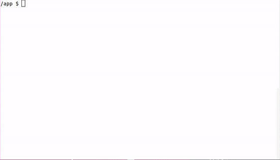

# Shlink installer

A PHP command line tool used to install [shlink](https://shlink.io/).

[](https://github.com/shlinkio/shlink-installer/actions?query=workflow%3A%22Continuous+integration%22)
[](https://app.codecov.io/gh/shlinkio/shlink-installer)
[](https://dashboard.stryker-mutator.io/reports/github.com/shlinkio/shlink-installer/develop)
[](https://packagist.org/packages/shlinkio/shlink-installer)
[](https://github.com/shlinkio/shlink-installer/blob/main/LICENSE)
[](https://slnk.to/donate)



## Installation

Install this tool using [composer](https://getcomposer.org/).

    composer install shlinkio/shlink-installer

## Usage

This is the command line tool used by [shlink](https://github.com/shlinkio/shlink) to guide you through the installation process.

The tool expects the working directory to be a valid shlink instance.

In order to run it, use the built-in CLI entry point.

Run `vendor/bin/shlink-installer` to print all available commands.

```
Shlink installer

Usage:
  command [options] [arguments]

Options:
  -h, --help            Display help for the given command. When no command is given display help for the list command
  -q, --quiet           Do not output any message
  -V, --version         Display this application version
      --ansi|--no-ansi  Force (or disable --no-ansi) ANSI output
  -n, --no-interaction  Do not ask any interactive question
  -v|vv|vvv, --verbose  Increase the verbosity of messages: 1 for normal output, 2 for more verbose output and 3 for debug

Available commands:
  help        Display help for a command
  install     Guides you through the installation process, to get Shlink up and running.
  list        List commands
  set-option  Allows you to set new values for any config option.
  update      Helps you import Shlink's config from an older version to a new one.
```

The most important ones are these:

* `install`: Used to set up Shlink from scratch.
* `update`: Used to update an existing Shlink instance. Will allow importing the config, skipping the options that already have a value.
* `set-option`: Allows to set the value for an individual option, in case you want to update it.

## Customize options

### Questions to ask the user

In order to retain backwards compatibility, it is possible to configure the installer to ask just a specific subset of questions.

Add a configuration file including a configuration like this:

```php
<?php

declare(strict_types=1);

use Shlinkio\Shlink\Installer\Config\Option;

return [

    'installer' => [
        'enabled_options' => [
            Option\Database\DatabaseDriverConfigOption::class,
            Option\Database\DatabaseHostConfigOption::class,
            Option\BasePathConfigOption::class,
            Option\Redirect\Regular404RedirectConfigOption::class,
            Option\UrlShortener\ShortDomainHostConfigOption::class,
            Option\UrlShortener\ShortDomainSchemaConfigOption::class,
        ],
    ],

];
```

> If `installer.enabled_options` is not provided at all, all the config options will be asked.

### Commands to run after installation

After the user has been asked for all the config, the installer will run a set of scripts which will create/update the database, download assets, etc.

It is possible to overwrite those commands via configuration too, using a syntax like this:

```php
<?php

declare(strict_types=1);

return [

    'installer' => [
        'installation_commands' => [
            'db_create_schema' => [
                'command' => 'bin/shlink shlink:db:create',
            ],
            'db_migrate' => [
                'command' => 'bin/some-script some:command',
            ],
            'orm_proxies' => [
                'command' => '-v', // Just print PHP version
            ],
        ],
    ],

];
```

This example shows all the currently available commands. They are run in the order they have been set here. 

> **Important:** Take into consideration that all the commands must be PHP scripts, since the installer will prefix all of them with the php binary. 
